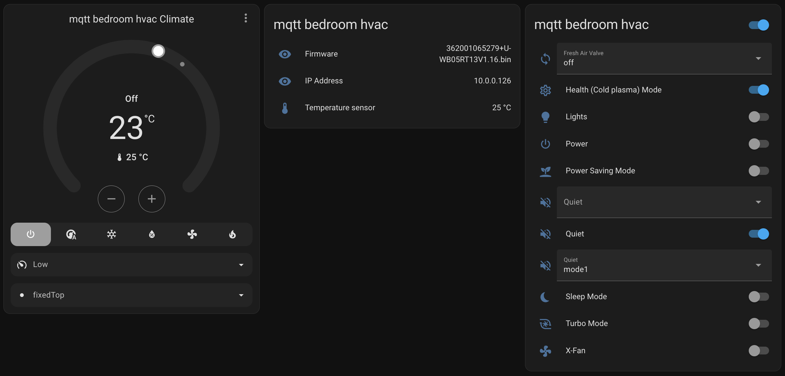

# Gree2MQTT Home Assistant Addon

This Home Assistant addon allows to integrate Gree protocol compatible HVAC devices.

If your device has WiFi and can be controlled using GREE or Ewpe Smart app then it should work.

Main features:
- Auto discovery using MQTT (no need to set up climate entity)
- Support multiple devices
- Reading current temperature from device and exposing as seperate entity
- Support all configuration options that are provided in Gree app (custom swing modes, etc.)
- Power entity for on/off function
- Handling Quit and Turbo modes through Fan speed - setting to lowest fan speed enables quiet mode and disables turbo; setting to auto disables queit and turbo; setting to maximum disables quiet and enables turbo.
- Supress beeping when changing settings



## Requirements

- Home Assistant and Gree smart HVAC device on the same network or NAT
- Docker (for local development)

## Installation

1. [](https://my.home-assistant.io/redirect/supervisor_add_addon_repository/?repository_url=https%3A%2F%2Fgithub.com%2Fguntiss%2Fgree2mqtt-ha-addon)
2. Install "Gree2MQTT" Addon (Reload page if addon doesn't appear)
3. Edit configuration - MQTT Broker and devices
4. Start the addon, configured devices should appear automatically in devices list (find by keyword `gree`)

## Configuration

When the host is only a controller and not an air conditioner, add `controllerOnly` option. VRF is usually the case.


## Supported devices

List of devices this addon has been tested to work with:

| WiFi Firmware                      | Indoor Unit Model                            |
|------------------------------------|----------------------------------------------|
| `362001065279+U-WB05RT13V1.16.bin` | Alpicair AWI-26HRDC1C, Alpicair AWI-36HRDC1C |


## Run development server locally using docker

Create a `options.json` file inside the repo with persistent addon configuration in JSON format, example configuration:
```json
{
  "debug": false,
  "mqtt": {
    "broker_url": "mqtt://mqtt_host",
    "username": "mqtt_user",
    "password": "mqtt_pass",
    "retain": false
  },
  "devices": [
    {
      "hvac_host": "10.0.0.101",
      "mqtt_topic_prefix": "home/hvac_bedroom"
    },
    {
      "hvac_host": "10.0.0.102",
      "mqtt_topic_prefix": "home/hvac_main"
    }
  ]
}
```

Run development docker container:

```sh
docker compose up
```

## License

This project is licensed under the GNU GPLv3 - see the [LICENSE.md](LICENSE.md) file for details

## Acknowledgments

This Addon is based off lelemka0`s gree-hvac-mqtt-bridge [fork](https://github.com/lelemka0/gree-hvac-mqtt-bridge/tree/177b51b36f574f82e3f43f3f6cecf0c684217c91).

- [tomikaa87](https://github.com/tomikaa87) for reverse-engineering the Gree protocol
- [oroce](https://github.com/oroce) for inspiration
- [arthurkrupa](https://https://github.com/arthurkrupa) for the actual service
- [bkbilly](https://github.com/bkbilly) for service improvements to MQTT
- [aaronsb](https://github.com/aaronsb) for sweeping the Node floor
- [mkaluza](https://github.com/mkaluza) for discovering [Beep supression code](https://github.com/maxim-smirnov/gree-wifimodule-firmware/issues/2#issuecomment-2232979090)
- [lelemka0](https://github.com/lelemka0) for multiple fixes, improvements and adding MQTT Discovery

## Todo
- Implement best logging practices from [example addon](https://github.com/hassio-addons/addon-example)
- Implement [dummy server](https://github.com/Hagakurje/GreeAC-DummyServer/blob/master/China%20Server%20Protokoll.txt) and [host configurator](https://github.com/Hagakurje/GreeAC-ConfigTool/blob/master/Program.cs)
- Implement [support for latest encryption (v2)](https://github.com/arthurkrupa/gree-hvac-mqtt-bridge/pull/90/files)
